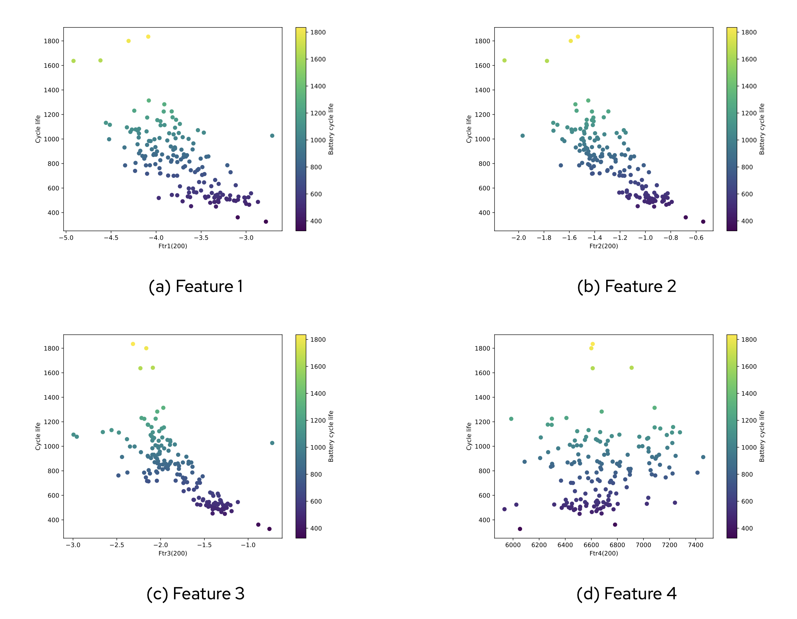
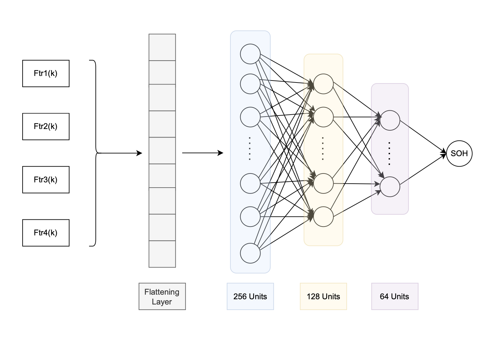

# Battery Lifespan Prediction with Custom Dense Neural Network

## Introduction
This project utilizes a custom-built Dense Neural Network to predict battery lifespan. The dataset used originates from MIT-Stanford and is available at [Matr.io](https://data.matr.io/1/). The website also provides additional details about the dataset.

The Jupyter notebooks (`file_1.ipynb`, `file_2.ipynb`, `file_3.ipynb`) contain step-by-step data extraction and preprocessing procedures. For a comprehensive explanation of the types of data used in this model, please refer to the accompanying report.

Below is a visualization of the input features used for training:

## Model Architecture
The model follows a Deep Learning approach, incorporating multiple dense layers to predict the State of Health (SOH) of a battery. The structure of the model is illustrated below:

## Results
The final results of the battery lifespan prediction model are compiled in a detailed report. The following document contains the key performance metrics and graphical evaluations:

[Download Results](result.pdf)

## Dependencies
To run this project, ensure you have the following dependencies installed:
- Python 3.x
- TensorFlow / Keras
- NumPy
- Pandas
- Matplotlib
- Jupyter Notebook

## How to Run
1. Clone this repository.
2. Install the required dependencies.
3. Open and execute the provided Jupyter notebooks (`file_1.ipynb`, `file_2.ipynb`, `file_3.ipynb`).
4. Train the model and evaluate the results.

## Contact
For any inquiries, please refer to the report or reach out to the project contributors.